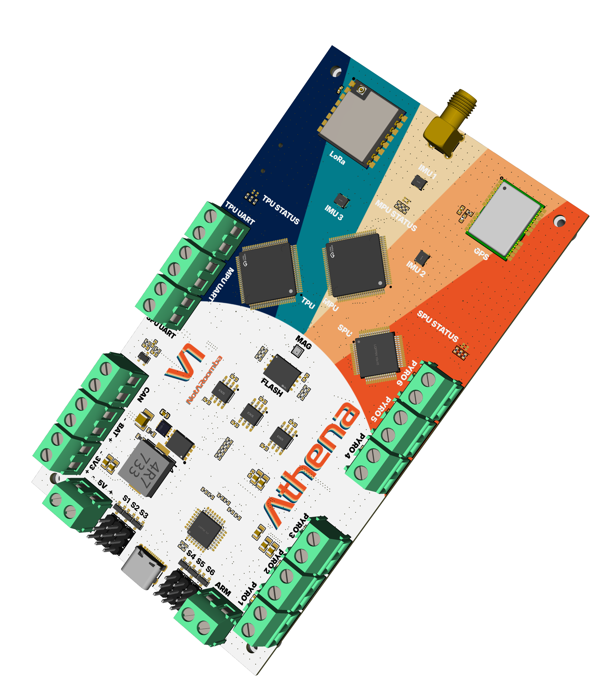

# August 9: Planning

I wanted a general purpose flight computer that has at least 6 pyro channels, 6 PWM channels (2 TVC, 4 Fins), GNSS (bluetooth maybe), LoRa for telemetry to ground, 7.4v LiPo battery, buck converter to 5v and 3.3v. I wanted this to be the most overkill possible so I added 3 MCU's with various tasks.

IMU:

- ICM-45686 (3x)

Magnetometer: LIS2MDLTR

Barometer:

- ICP-20100
- BMP388

Storage:

- SD Card
- Winbond W25Q256JV

CAN Transceiver: TCAN1057AVDRQ1

USB Hub: TUSB2036

GNSS: NEO-M8U-06B

Bluetooth: DA14531MOD-00F01002

LoRa: RA-02

MCU:

- STM32H753VIT6 (MPU, Sensors/Kalmann Filter)
- STM32H743VIT6 (TPU, LoRa/SD/Flash)
- STM32G474RET6 (SPU, Pyro/PWM)

Battery Charger: BQ25703ARSNR

USB-C PD: TPS25750

Servo Buck: AP64501SP-13

3.3v Buck: TPS5430

After selecting the components that I wanted, I began to add them to EasyEDA. I started off with placing the STM's and then their clocks and decoupling caps. (There are obviously more components, check the README for the complete and updated feature list)

**Total Time:** 5 hours

# August 10-11: More Component Placement

After the STM's were complete, I decided to work on the peripherals and power before going back and wiring them. So I started work on USB-C Power Delivery.

I then started working on the battery IC, making sure that the resistors and footprints were correct and trying to organize it in a way so that it looks good and not so messy.

After that, I started working on the buck and boost converters and ended up choosing some parts for the current amperage that I was going to be working with.

**Total Time:** 12 hours

# August 12: Sensors

I didn't have much time today, so I wanted to work on the sensors to at least finish something and wired them all up, making sure that they each have their own SDA line for fast data transfer.

**Total Time:** 4 hours

# August 14: Servos and Realization

I started placing the servos, but I wanted to double check my math as I had some friends not have enough amps for a robot that they were designing. After checking the amperage of the 5V buck, I decided that it wouldn't be enough, so I created another one using TI's web designer and then copied the schematic. I ended up using the LM5145RGYR.

**Total Time:** 6 hours

# August 15-17: Peripherals

I spent the next 2 days drawing the schematics of all of the peripherals: GPS, LoRa, Bluetooth, SD card, USB hub, CAN transceiver, and also flash memory. I was grinding through it and forgot to take photos, but here's the final design. I also included the pyro channels using fuses to protect them and connecting them directly to the 12V battery.

**Total Time:** 16 hours

# August 18: Start of placement

I started the placement with the STM's, and as I wanted to base my design off of the AVA flight controller, I wanted all of the passive components in the back and the ICs in the front like flash and GPS and all of that, so I started work on adding all of the decoupling caps for each STM.

**Total Time:** 8 hours

# August 20: Grouping

I started working on grouping all of the components together with their respective caps and stuff to get a view of where to place them. It took a while, especially because of the power as it needed special planes that I had to take into account, so I decided to upgrade the board from 4 layers to 6 layers and have a dedicated power plane.

**Total Time:** 6 hours

# August 23: Procrastination and Power Section

After grouping all of the components, I decided that I wanted the board to be 80x140mm, so I created the outline and then started adding the components along the borders. I procrastinated this step a lot and in reality this took over 2 days, but anyway. Here's a cool screenshot from me trying to route the battery/power section (I was dying).

**Total Time:** 8 hours

# August 24-29: Routing Hell

After getting the power section done, I then started routing the rest of the components. This took a while and it was really repetitive, and I don't have enough photos, but I was feeling some burnout throughout.

Here's a funny pic of multi-routing gone wrong with the SD card lol.

I started routing the peripherals (including the SD card) and all of the Bluetooth and stuff using the dedicated signal layer when possible and sometimes into one of the ground planes (in extreme cases like at the end).

After a few days, I ended up with this. It was almost done but I still had some connections left.

After another day of routing and tearing my hair out, I took this photo.

I still had a lot left to go but was feeling burnt out.

**Total Time:** 32 hours

# September 3: Finished Routing

After a few days of burnout, I decided to finally finish the routing. I also filled in the planes to make it look nice, and even though nothing is seen at first, here is the final layout with the different layers.

Here's the power plane:

Signal layer:

Bottom layer:

**Total Time:** 8 hours

# September 4: Silkscreen and Logo

Like AVA, I wanted a cool clan-ish silkscreen, so I removed all of the silkscreen on the front and changed the names of the components. I also created a cool retro color effect in Figma to take advantage of JLCPCB's color silkscreen technology. I also included the name (Athena) and v1 and my username NotARoomba. I created a 2D image of the board to create an image for the entire silkscreen layer, and with a few masks and stuff in Figma, I ended up with this design.

Here is the final board front and back

**Total Time:** 2 hours

# October 10 - Start of CAD

I wanted to learn Inventor and 3D modeling so I decided to start work on the rocket using Openrocket and then passing it on to inventor.

For the TVC I want to use MG995 servos because of their high torque and high speed.
